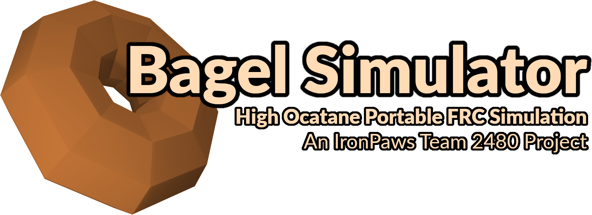

# 

## Play

Web builds are automatically uploaded to [team2480.org/simulator/](https://team2480.org/simulator/) and [team-2480.github.io/BagelSim/](https://team-2480.github.io/BagelSim/)


[Join the BagelSim discord](https://discord.gg/8kcHXmfWJx) to stay up to date with BagelSim development.

[Donate to our team](https://www.paypal.com/donate?hosted_button_id=HQUMDHSWMTB7J) if you'd like to support the work we do!

## Local Development Setup

Development is done on MacOS and Linux open up WSL if your on Windows. I'd recommend a fairly up to date enviroment.

**C++23 Compiler** this is GCC 15 or Clang 20. We run on modern C++ features.

**CMake 4.0** or above, our buildsystem.

**Make** most version of make should work fine.

```sh
mkdir -p build
cd build
cmake .. -GMake -DCMAKE_BUILD_TYPE=Debug # debug will include address sanitization + symbols

# replace the number after 4 with your core count
make -j4

# NOTE: must be run from BagelSim/build/ as files are not bundled into the binary
src/bagelsim
```

## Project Priorities

Be portable & lightweight. BagelSimulator should be able to run on most modern devices. Dependencies will always be add via [FetchContent](https://cmake.org/cmake/help/latest/module/FetchContent.html).

Simulate gameplay. BagelSimulator is a tool for improving skill and having fun, not testing robot code.

Be maintainable. BagelSimulator only survives as a group effort so the code should be built to last and be replaced.

*Please make issues & pull requests if you have feedback! Even if this is your first time.*
